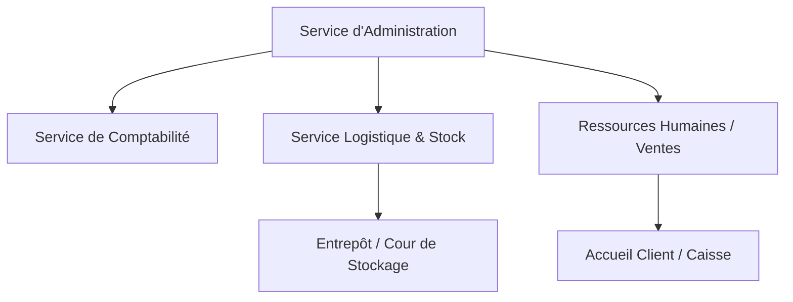
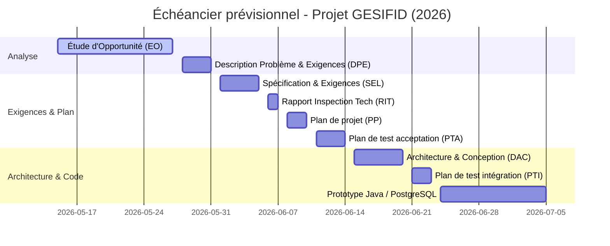

# ÉTUDE D'OPPORTUNITÉ

## Plateforme de Gestion de Stock Intelligente et de Fidélisation Client (GESIFID)

   
  <strong>Université de Jacmel</strong> 
  <em>Département des Sciences Informatiques</em>
    
  <h3>Organisation : Entreprise Rendez-vous</h3>
  
<strong>Slogan :</strong> <em>« Bâtir l'avenir en toute confiance »</em>

   
  

   
  <strong>Version :</strong> 1.0 | <strong>Date :</strong> 27 mai 2026 
  <strong>Préparé par :</strong> Groupe d'Ingénierie Logicielle 
  <strong>Client :</strong> Direction de l'Entreprise Rendez-vous
    

---

### Historique des versions

##### Tableau 1 : Historique des versions

| Version | Phase | Date | Auteur / Équipe | Description |
| :--- | :--- | :--- | :--- | :--- |
| **1.0** | Initiale | 27/05/2026 | Équipe Projet Java | Étude d'opportunité initiale pour le système GESIFID. |

> [!NOTE]
> **Respect de la confidentialité :** Afin de préserver la confidentialité des données de l'entreprise, aucun nom complet d'employé ou de membre du personnel n'est divulgué dans ce document public.

---

### Table des matières

- [Historique des versions](#historique-des-versions)
- [Table des matières](#table-des-matières)
- [Liste des tableaux](#liste-des-tableaux)
- [Liste des acronymes et abréviations](#liste-des-acronymes-et-abréviations)
- [Sommaire de l'étude](#sommaire-de-létude)
- [1. L'Organisation](#1-lorganisation)
  - [1.1 Mission et historique](#11-mission-et-historique)
  - [1.2 Structure organisationnelle](#12-structure-organisationnelle)
  - [1.3 Périmètre de l'étude](#13-périmètre-de-létude)
- [2. Contexte du problème](#2-contexte-du-problème)
  - [2.1 Situation géographique et opérationnelle](#21-situation-géographique-et-opérationnelle)
  - [2.2 Fonctionnement actuel des processus clés](#22-fonctionnement-actuel-des-processus-clés)
  - [2.3 Limites du système actuel](#23-limites-du-système-actuel)
- [3. Inventaire des problèmes et des besoins](#3-inventaire-des-problèmes-et-des-besoins)
  - [3.1 Problèmes identifiés](#31-problèmes-identifiés)
  - [3.2 Besoins dérivés](#32-besoins-dérivés)
- [4. Objectifs des changements à réaliser](#4-objectifs-des-changements-à-réaliser)
- [5. Solutions possibles](#5-solutions-possibles)
  - [5.1 Solution 1 — Non liée à l'informatique](#51-solution-1--non-liée-à-linformatique)
  - [5.2 Solution 2 — Acquisition d'un progiciel standard](#52-solution-2--acquisition-dun-progiciel-standard)
  - [5.3 Solution 3 — Adaptation d'un progiciel existant](#53-solution-3--adaptation-dun-progiciel-existant)
  - [5.4 Solution 4 — Développement d'un logiciel sur mesure](#54-solution-4--développement-dun-logiciel-sur-mesure)
- [6. Bénéfices et coûts de chaque solution](#6-bénéfices-et-coûts-de-chaque-solution)
  - [6.1 Coûts de la Solution 1 (Non informatique)](#61-coûts-de-la-solution-1-non-informatique)
  - [6.2 Coûts des solutions informatiques (2, 3, 4)](#62-coûts-des-solutions-informatiques-2-3-4)
  - [6.3 Analyse bénéfices-coûts](#63-analyse-bénéfices-coûts)
- [7. Faisabilité et risques technologiques](#7-faisabilité-et-risques-technologiques)
- [8. Recommandation finale](#8-recommandation-finale)
- [9. Mandat pour la suite des travaux](#9-mandat-pour-la-suite-des-travaux)
- [10. Échéancier de l'équipe](#10-échéancier-de-léquipe)
- [Bibliographie](#bibliographie)
- [Annexe Technique](#annexe-technique)

---

### Liste des tableaux

- **Tableau 1 :** Historique des versions
- **Tableau 2 :** Liste des acronymes et abréviations
- **Tableau 3 :** Coûts du personnel — Site A (Cayes-Jacmel)
- **Tableau 4 :** Coûts du personnel — Site B (Non Applicable)
- **Tableau 5 :** Coûts du personnel — Site C (Non Applicable)
- **Tableau 6 :** Coût total des trois sites (Solution 1)
- **Tableau 7 :** Coûts des équipements (Solutions 2, 3 et 4)
- **Tableau 8 :** Coûts d'achat des logiciels — Solution 2
- **Tableau 9 :** Coûts d'achat des logiciels — Solution 3
- **Tableau 10 :** Coûts d'achat des logiciels — Solution 4
- **Tableau 11 :** Coûts récurrents annuels par solution
- **Tableau 12 :** Bénéfices et coûts — Première année
- **Tableau 13 :** Bénéfices et coûts — Deuxième année
- **Tableau 14 :** Échéancier de livraison de l'équipe projet

---

### Liste des acronymes et abréviations

##### Tableau 2 : Liste des acronymes et abréviations

| Acronyme / Abréviation | Définition |
| :--- | :--- |
| **GESIFID** | Gestion de Stock Intelligente et Fidélisation. |
| **SGBD** | Système de Gestion de Base de Données. |
| **HTG** | Gourde Haïtienne (Devise nationale d'Haïti). |
| **TPE** | Terminal de Point de Vente (*Terminal de Paiement Électronique / Point of Sale*). |
| **ERP** | *Enterprise Resource Planning* (Progiciel de Gestion Intégré - PGI). |
| **SMART** | *Specific, Measurable, Achievable, Realistic, Time-bound* (Objectifs spécifiques, mesurables, atteignables, réalistes et temporellement définis). |

---

### Sommaire de l'étude

Le présent document constitue une étude d'opportunité complète réalisée pour le compte de l'**Entreprise Rendez-vous**. Cette étude vise à identifier les problèmes opérationnels majeurs liés à la gestion manuelle des stocks et de la clientèle, à analyser les besoins de l'organisation et à proposer une solution logicielle sur mesure en vue d'orienter stratégiquement l'investissement technologique de l'entreprise.

Face à la croissance rapide des ventes de matériaux de construction (ciment, fer, peinture, outillage), le système actuel de gestion sur registres papier montre des limites critiques. Afin de pallier ces lacunes, nous recommandons le développement d'une application de bureau moderne en **Java**, connectée à un système de gestion de base de données (SGBD) robuste et libre de droits, **PostgreSQL**. Cette solution permettra un suivi en temps réel du stock, l'impression instantanée de mini-fiches de transaction pour les clients et l'automatisation intelligente d'un programme de fidélisation client, garantissant un retour sur investissement optimal dès la première année d'exploitation.

---

### 1. L'Organisation

L'**Entreprise Rendez-vous** est une quincaillerie de premier plan établie à **Cayes-Jacmel** (Sud-Est d'Haïti). Elle s'est imposée comme un acteur incontournable dans la distribution de matériaux de construction essentiels. Fondée pour répondre à la forte dynamique d'urbanisation et au besoin croissant de développement des infrastructures locales, l'entreprise dessert activement les entrepreneurs en bâtiment, les maîtres-maçons et les particuliers de la région jacmélienne.

#### 1.1 Mission et historique
La mission principale de l'Entreprise Rendez-vous est de fournir des matériaux de construction de haute qualité, associés à un approvisionnement fiable et un service clientèle d'excellence, afin de soutenir durablement le développement résidentiel, commercial et public de la communauté de Cayes-Jacmel.

#### 1.2 Structure organisationnelle
L'organisation repose sur une structure humaine et fonctionnelle optimisée :
*   **Service d'administration :** Assure la gouvernance globale, la planification stratégique et la négociation avec les fournisseurs de matériaux lourds.
*   **Service de comptabilité :** Supervise la caisse, effectue les encaissements, gère la trésorerie et le suivi rigoureux des dépenses.
*   **Service logistique et stock :** Coordonne la réception des marchandises (ciment, barres de fer, peinture), supervise le déchargement et s'occupe de la livraison dans la cour de stockage.
*   **Service des ventes & Relations clients :** Gère le personnel de cour, assure l'accueil des clients au comptoir et traite les requêtes d'achat immédiat.

#### 1.3 Périmètre de l'étude
L'analyse de cette étude d'opportunité cible de manière stricte et exclusive les processus opérationnels suivants :
1.  Les ventes au comptoir et l'encaissement direct.
2.  Le contrôle et la synchronisation des flux de stocks en magasin et à l'entrepôt.
3.  Le mécanisme d'attribution, de calcul et de suivi des remises commerciales accordées aux clients réguliers (programme de fidélisation).

---

### 2. Contexte du problème

L'Entreprise Rendez-vous fonctionne actuellement selon un modèle traditionnel non informatisé, s'appuyant intégralement sur des processus manuels.

#### 2.1 Situation géographique et opérationnelle
Le point de vente unique de Cayes-Jacmel regroupe en un même lieu le bureau d'administration, l'espace caisse pour la facturation et une cour de stockage/entrepôt physique pour les matériaux lourds. Les flux de communication et d'information opérationnels entre la caisse et la cour de stockage se font soit verbalement, soit par le biais de fiches volantes rédigées à la main.

#### 2.2 Fonctionnement actuel des processus clés
Lorsqu'un client se présente pour acquérir du matériel (par exemple, 50 sacs de ciment et 5 pots de peinture) :
1.  **Vérification :** Le caissier vérifie la disponibilité de l'article de mémoire ou doit se déplacer physiquement vers la cour de stockage.
2.  **Facturation :** Il rédige manuellement une facture en double exemplaire sur un carnet de reçus papier autocopiant.
3.  **Encaissement :** Le client règle la facture à la caisse.
4.  **Livraison :** Le client se déplace à l'entrepôt et présente son reçu papier au personnel de cour, qui procède manuellement au comptage et au chargement des marchandises.
5.  **Mise à jour :** En fin de journée, les sorties sont saisies sur un registre général papier pour évaluer le niveau théorique des stocks restants.

#### 2.3 Limites du système actuel
Cette méthode de travail traditionnelle génère des goulots d'étranglement majeurs :
*   **Ruptures de stock non anticipées :** Les matériaux critiques (ciment, fer de construction) subissent des ruptures régulières sans alerte, occasionnant des pertes immédiates de chiffre d'affaires et une frustration chez les clients professionnels.
*   **Lenteur extrême de facturation :** La saisie manuscrite systématique rallonge dramatiquement les files d'attente lors des heures de pointe (les jours de marché ou en début de matinée).
*   **Gestion opaque et arbitraire de la fidélité :** Les remises commerciales accordées aux clients récurrents dépendent de la mémoire du caissier ou de calculs mentaux subjectifs, générant des écarts de caisse, des injustices ressenties et une érosion de la marge commerciale.

---

### 3. Inventaire des problèmes et des besoins

#### 3.1 Problèmes identifiés

##### Tableau 3 : Inventaire des problèmes de gestion

| Réf. | Problème Identifié | Cause Initiale | Conséquences sur l'Entreprise |
| :--- | :--- | :--- | :--- |
| **P1** | Écarts fréquents et retards majeurs de mise à jour des stocks. | Saisie manuelle différée sur registre papier en fin de journée. | Ruptures de stock imprévues sur les produits phares (ciment, fer), ventes ratées, détérioration de l'image de marque. |
| **P2** | File d'attente prolongée au comptoir de facturation. | Rédaction manuscrite fastidieuse de chaque ligne de commande sur reçu papier. | Inconfort client, baisse de la productivité, surcharge de travail du caissier. |
| **P3** | Manque de cohérence et calcul arbitraire des remises clients. | Absence de système d'archivage client et de règles automatisées. | Pertes financières directes (erreurs de calcul) ou insatisfaction des clients fidèles lésés. |

#### 3.2 Besoins dérivés
*   **Besoin B1 (issu de P1) :** Mettre en place un outil de suivi informatisé et en temps réel de l'état des stocks, intégrant un système d'alertes visuelles automatisées dès qu'un produit franchit son seuil minimum d'approvisionnement.
*   **Besoin B2 (issu de P2) :** Déployer une interface d'encaissement rapide et intuitive, reliée à une imprimante thermique pour éditer instantanément des mini-fiches (reçus de vente standardisés).
*   **Besoin B3 (issu de P3) :** Concevoir un module de fidélisation centralisé et paramétrable, permettant d'associer chaque transaction à un profil client et d'appliquer automatiquement les rabais commerciaux prédéfinis par l'administration.

---

### 4. Objectifs des changements à réaliser

Pour guider le projet de transformation technologique, la direction a fixé des objectifs stratégiques selon la méthodologie **SMART** :

> [!IMPORTANT]
> **Objectifs SMART du projet GESIFID :**
> *   **Objectif 1 (Rapidité) :** Réduire le temps moyen de traitement d'une vente au comptoir de **3 minutes à moins de 45 secondes** dès les 30 premiers jours suivant le déploiement opérationnel.
> *   **Objectif 2 (Précision) :** Atteindre et maintenir une correspondance de **99,5%** entre le stock informatique théorique et le stock physique grâce à la mise à jour automatique et instantanée de la base de données lors de chaque encaissement.
> *   **Objectif 3 (Fidélisation) :** Automatiser à **100%** l'application des règles commerciales complexes (ex. : octroi systématique de 5% de remise dès le franchissement de 100 sacs de ciment cumulés sur un trimestre) pour éliminer définitivement l'arbitraire et les erreurs humaines à la caisse.

---

### 5. Solutions possibles

Quatre voies de résolution ont été étudiées pour répondre aux besoins de l'Entreprise Rendez-vous.

#### 5.1 Solution 1 — Non liée à l'informatique (Réorganisation manuelle)
Cette solution consiste à embaucher deux commis administratifs supplémentaires :
*   Le premier commis serait basé en permanence dans la cour de stockage pour mettre à jour les fiches de stock carton sur une base horaire.
*   Le second commis assisterait le caissier pour pré-remplir les factures manuelles et fluidifier la file d'attente.
*   *Limites :* Elle n'élimine pas l'erreur humaine de saisie, ne résout pas le problème d'analyse prédictive et engendre une hausse permanente et croissante de la masse salariale.

#### 5.2 Solution 2 — Acquisition d'un progiciel standard
Cette solution repose sur l'achat d'une licence pour un progiciel de gestion commerciale standard du marché (ERP propriétaire générique).
*   *Limites :* Les ERP génériques sont complexes à prendre en main pour une petite équipe, nécessitent une forte bande passante internet (souvent indisponible localement à Cayes-Jacmel) et n'offrent pas d'intégration native simple pour les imprimantes thermiques de 58 mm. De plus, ils exigent des frais de licence récurrents annuels prohibitifs.

#### 5.3 Solution 3 — Adaptation d'un progiciel existant
Cette solution consiste à déployer une solution open-source existante (Dolibarr ou Odoo Community) hébergée localement, et à développer des extensions spécifiques.
*   *Limites :* Bien que cette solution évite un développement complet, la lourdeur d'intégration des modules spécifiques de fidélité et le paramétrage pour l'impression thermique directe sur ticket 58 mm restent complexes et restrictifs. De plus, l'interface utilisateur générale reste surchargée et peu adaptée à des utilisateurs non formés à l'outil informatique de gestion complexe.

#### 5.4 Solution 4 — Développement d'un logiciel sur mesure (Recommandée)
Concevoir une application de bureau légère et performante développée en **Java** (utilisant JavaFX pour une interface graphique moderne et intuitive, et JDBC pour la liaison de données), couplée à un serveur de base de données local sous **PostgreSQL** (robuste, performant et 100% gratuit).
*   *Avantages :* L'application s'adapte précisément aux processus de la quincaillerie, intègre directement les modules d'impression de tickets thermiques à faible coût (58 mm) et permet de paramétrer dynamiquement les seuils d'alerte de stock ainsi que le barème de fidélité. Cette solution fonctionne en réseau local autonome (sans dépendance à une connexion internet constante).

---

### 6. Bénéfices et coûts de chaque solution

> [!TIP]
> **Hypothèse financière :** Toutes les valeurs budgétaires ci-dessous sont présentées directement en **Gourdes Haïtiennes (HTG)** pour correspondre précisément au contexte économique local de Cayes-Jacmel. Les tarifs ont été rationalisés et diminués pour s'adapter à la réalité d'une petite ou moyenne quincaillerie en Haïti.

#### 6.1 Coûts de la Solution 1 (non informatique)

##### Tableau 3 : Coûts du personnel — Site A (Cayes-Jacmel)

| Poste | Coût mensuel / employé (HTG) | Coût annuel + bonus (HTG) |
| :--- | :--- | :--- |
| Commis de registre de stock (1) | 20 000 HTG | 260 000 HTG |
| Commis d'aide-facturation (1) | 20 000 HTG | 260 000 HTG |
| **Total** | **40 000 HTG** | **520 000 HTG** |

##### Tableau 4 : Coûts du personnel — Site B (Non Applicable)
*Ce projet concerne un point de vente unique à Cayes-Jacmel (Site A). Aucun personnel n'est affecté à un autre site.*

##### Tableau 5 : Coûts du personnel — Site C (Non Applicable)
*Ce projet concerne un point de vente unique à Cayes-Jacmel (Site A). Aucun personnel n'est affecté à un autre site.*

##### Tableau 6 : Coût total des trois sites

| Site | Coût total (HTG) |
| :--- | :--- |
| Site A (Cayes-Jacmel) | 520 000 HTG |
| Site B | 0 HTG |
| Site C | 0 HTG |
| **TOTAL** | **520 000 HTG** |

#### 6.2 Coûts des solutions informatiques (2, 3, 4)

##### Tableau 7 : Coûts des équipements (communs aux solutions 2, 3 et 4)

| Équipement | Quantité | Prix unitaire (HTG) | Coût total (HTG) |
| :--- | :--- | :--- | :--- |
| Ordinateur de caisse professionnel | 1 | 65 000 HTG | 65 000 HTG |
| Imprimante thermique (mini-fiches 58 mm) | 1 | 15 000 HTG | 15 000 HTG |
| Routeur / Switch réseau local Ethernet | 1 | 8 000 HTG | 8 000 HTG |
| **TOTAL** | — | — | **88 000 HTG** |

##### Tableau 8 : Coûts d’achat des logiciels — Solution 2 (Progiciel Standard)

| Description | Solution 2 (HTG) |
| :--- | :--- |
| Achat / analyse | 120 000 HTG |
| Modification / développement | 0 HTG |
| Installation et tests | 30 000 HTG |
| Formation | 0 HTG |
| **TOTAL** | **150 000 HTG** |

##### Tableau 9 : Coûts d’achat des logiciels — Solution 3 (Progiciel Adapté)

| Description | Solution 3 (HTG) |
| :--- | :--- |
| Achat / analyse | 50 000 HTG |
| Modification / développement | 80 000 HTG |
| Installation et tests | 30 000 HTG |
| Formation | 20 000 HTG |
| **TOTAL** | **180 000 HTG** |

##### Tableau 10 : Coûts d’achat des logiciels — Solution 4 (Sur Mesure)

| Description | Solution 4 (HTG) |
| :--- | :--- |
| Achat / analyse | 40 000 HTG |
| Modification / développement | 150 000 HTG |
| Installation et tests | 30 000 HTG |
| Formation | 0 HTG |
| **TOTAL** | **220 000 HTG** |

##### Tableau 11 : Coûts récurrents annuels par solution

| Nature du coût récurrent | Solution 2 | Solution 3 | Solution 4 |
| :--- | :--- | :--- | :--- |
| Entretien & Support | 45 000 HTG / an | 25 000 HTG / an | 15 000 HTG / an |
| **TOTAL / AN** | **45 000 HTG** | **25 000 HTG** | **15 000 HTG** |

#### 6.3 Analyse bénéfices-coûts

##### Tableau 12 : Bénéfices et coûts — Première année

| Nature | Solution 1 | Solution 2 | Solution 3 | Solution 4 |
| :--- | :--- | :--- | :--- | :--- |
| Bénéfices du personnel (HTG) | — | 0 HTG | 0 HTG | 0 HTG |
| Revenus sur frais (HTG) | — | 0 HTG | 0 HTG | 0 HTG |
| Autres bénéfices (HTG) | 0 HTG | 160 000 HTG | 280 000 HTG | 400 000 HTG |
| **Total bénéfices (HTG)** | **0 HTG** | **160 000 HTG** | **280 000 HTG** | **400 000 HTG** |
| Coûts récurrents (HTG) | 520 000 HTG | 45 000 HTG | 25 000 HTG | 15 000 HTG |
| Coûts non récurrents (HTG) | — | 150 000 HTG | 180 000 HTG | 220 000 HTG |
| Coût d’investissement (HTG) | — | 88 000 HTG | 88 000 HTG | 88 000 HTG |
| **Total coûts (HTG)** | **520 000 HTG** | **283 000 HTG** | **293 000 HTG** | **323 000 HTG** |
| **Bénéfice net (HTG)** | **(520 000 HTG)** | **(123 000 HTG)** | **(13 000 HTG)** | **+77 000 HTG** |

##### Tableau 13 : Bénéfices et coûts — Deuxième année

| Nature | Solution 1 | Solution 2 | Solution 3 | Solution 4 |
| :--- | :--- | :--- | :--- | :--- |
| **Total bénéfices (HTG)** | **0 HTG** | **160 000 HTG** | **320 000 HTG** | **460 000 HTG** |
| Coûts récurrents (HTG) | 520 000 HTG | 45 000 HTG | 25 000 HTG | 15 000 HTG |
| **Total coûts (HTG)** | **520 000 HTG** | **45 000 HTG** | **25 000 HTG** | **15 000 HTG** |
| **Bénéfice net annuel (HTG)**| **(520 000 HTG)** | **+115 000 HTG** | **+295 000 HTG** | **+445 000 HTG** |
| **Bénéfice net cumulé (HTG)**| **(1 040 000 HTG)**| **(8 000 HTG)** | **+282 000 HTG** | **+522 000 HTG** |

> [!TIP]
> **Rentabilité constatée :** Grâce à l'absence totale de licences récurrentes (Java et PostgreSQL étant open source), la **Solution 4 (Sur Mesure) devient rentable dès la fin de la première année** (+77 000 HTG), pour exploser en année 2 avec un gain cumulé estimé à **+522 000 HTG**.

---

### 7. Faisabilité et risques technologiques

##### Tableau 8 : Évaluation de la faisabilité et des risques

| Solution Envisagée | Faisabilité Technique | Risques Majeurs Identifiés | Niveau de Risque | Plan de contingence proposé |
| :--- | :--- | :--- | :---: | :--- |
| **Solution 1** (Manuel) | **Haute** | Erreurs humaines persistantes, démission ou rotation fréquente du personnel. | **Élevé** | Aucun (système dépendant de l'humain). |
| **Solution 2** (ERP Standard) | **Moyenne** | Incompatibilité de l'ERP avec l'imprimante thermique locale, dépendance à Internet. | **Moyen** | Souscrire à une connexion satellite coûteuse. |
| **Solution 3** (ERP Adapté) | **Moyenne à Haute** | Complexité et instabilité lors de la programmation personnalisée des modules de fidélité et d'impression. | **Moyen** | Faire appel à un intégrateur spécialisé externe. |
| **Solution 4** (Sur Mesure) | **Haute** | Retards potentiels de codage, instabilité électrique locale (pannes de courant). | **Faible à Moyen** | Intégration d'un onduleur (UPS) matériel et gestion locale hors-ligne. |

---

### 8. Recommandation finale

Au terme de cette analyse approfondie, nous recommandons formellement la **Solution 4 : Développement d'un logiciel sur mesure en Java et PostgreSQL**.

**Justification de notre choix :**
1.  **Rejet de la Solution 1 :** Bien que facile à mettre en place à court terme, elle génère d'importantes charges d'exploitation annuelles (520 000 HTG) sans corriger le problème d'exactitude des stocks ni de lenteur au comptoir.
2.  **Rejet de la Solution 2 :** L'ERP standard présente une trop grande rigidité technique, nécessite des compétences spécifiques de maintenance externe et génère des coûts de licence superflus peu adaptés à l'économie d'une PME locale.
3.  **Rejet de la Solution 3 :** L'adaptation d'un progiciel existant engendre des surcoûts d'intégration technique et d'adaptation des modules spécifiques (fidélisation et impression thermique 58 mm) pour une interface finale jugée trop lourde.
4.  **Adoption de la Solution 4 :** C'est la seule option garantissant un alignement à 100% avec les besoins métiers de l'Entreprise Rendez-vous (calcul automatique de la fidélité, impression instantanée sur ticket 58 mm, notifications de stock). L'infrastructure logicielle basée sur Java et PostgreSQL garantit l'indépendance de l'entreprise vis-à-vis des éditeurs de logiciels payants.

---

### 9. Mandat pour la suite des travaux

Dès validation et signature de cette étude d'opportunité par la direction générale de l'Entreprise Rendez-vous, le groupe d'ingénierie logicielle se verra confier le mandat d'entamer la phase d'ingénierie suivante :
1.  **Spécification des cas d'utilisation :** Recueillir et documenter en détail tous les flux de l'application (*ex: Ajouter un produit au stock*, *Vendre des articles*, *Émettre un rabais fidélité*, *Consulter l'alerte de stock*).
2.  **Maquettage UI :** Présenter des maquettes d'interface utilisateur pour la fenêtre de facturation comptoir afin de recueillir le feedback des futurs opérateurs de caisse.
3.  **Conception de base de données :** Modéliser les schémas conceptuel (MCD) et physique (MPD) de la base PostgreSQL.

 

| Responsable (rôle) | Firme mandataire (rôle) |
| :--- | :--- |
| [Directeur Général] **Entreprise Rendez-vous** | [Chef de Projet Logiciel] **Firme Mandataire / Groupe Projet Java** |

*(Seuls les titres de postes sont affichés conformément aux règles de confidentialité).*

---

### 10. Échéancier de l'équipe

Le projet respectera le calendrier opérationnel rigoureux défini ci-dessous :

##### Tableau 14 : Échéancier de livraison de l'équipe projet

| Livrable | Participants | Responsable | Début | Fin | Durée (h) | Durée (j) |
| :--- | :--- | :--- | :---: | :---: | :---: | :---: |
| **Étude d'opportunité (EO)** | Équipe entière | Analyste Logiciel | 15/05/2026 | 27/05/2026 | 60 h | 12 j |
| **Description du problème et exigences (DPE)** | Analyste, Client | Analyste Logiciel | 28/05/2026 | 31/05/2026 | 20 h | 4 j |
| **Spécification et exigences du logiciel (SEL)**| Concepteur, Client| Concepteur UI/UX | 01/06/2026 | 05/06/2026 | 25 h | 5 j |
| **Rapport d'inspection technique (RIT)** | Concepteur, Devs | Chef de Projet | 06/06/2026 | 07/06/2026 | 10 h | 2 j |
| **Plan de projet (PP)** | Chef de Projet | Chef de Projet | 08/06/2026 | 10/06/2026 | 15 h | 3 j |
| **Plan de test d'acceptation (PTA)** | Testeurs, Client | Spécialiste QA | 11/06/2026 | 14/06/2026 | 20 h | 4 j |
| **Document d'architecture & conception (DAC)** | Devs, DBA | Administrateur BD | 15/06/2026 | 20/06/2026 | 30 h | 6 j |
| **Plan de test d'intégration (PTI)** | Testeurs, Devs | Spécialiste QA | 21/06/2026 | 23/06/2026 | 15 h | 3 j |
| **Prototype** | Codeurs | Développeur Principal| 24/06/2026 | 05/07/2026 | 60 h | 12 j |

---

### Bibliographie

1.  **Documentation Officielle Java SE :** JDK 17 & 21 Specifications and JDBC Architecture Guidelines.
2.  **PostgreSQL 16 Manuals :** SQL Language, Transaction Control and Database Administration guides.
3.  **Méthodologie Agile & Ingénierie Logicielle :** Guide d'analyse et de rédaction des spécifications d'opportunité en entreprise de vente au détail.

---

### Annexe Technique

#### 1. Spécifications minimales de la machine caissier (Hôte PostgreSQL & Java)
*   **Processeur :** Intel Core i3 (10e Génération ou équivalent) cadencé à 2.0 GHz minimum.
*   **Mémoire RAM :** 8 Go DDR4 (permettant le fonctionnement fluide et simultané de la JVM Java et du serveur PostgreSQL).
*   **Disque Dur :** 256 Go SSD (pour des temps de lecture/écriture instantanés sur la base de données).
*   **Système d'exploitation :** Windows 10/11 Home ou Professionnel (64-bits).
*   **Alimentation de secours :** Onduleur standard de 650VA / 360W assurant une autonomie de 15 minutes en cas de coupure de courant.

#### 2. Paramétrage de l'imprimante de caisse
*   **Type de matériel :** Imprimante de ticket thermique directe de **58 mm**.
*   **Interface physique :** Port USB 2.0 standard.
*   **Vitesse d'impression :** 90 mm/sec minimum.
*   **Format d'édition :** Fichier de sortie au format texte brut encodé en UTF-8, envoyé directement via le pilote générique "Generic / Text Only" de Windows pour maximiser la vitesse d'impression.
