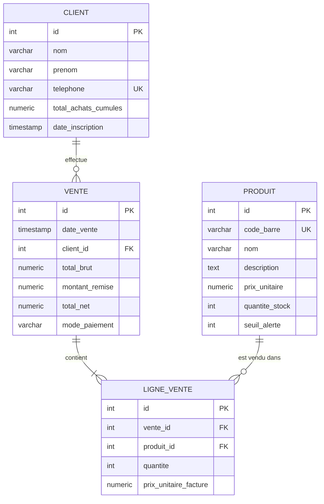

# CAHIER DES CHARGES TECHNIQUE & GUIDE D'ARCHITECTURRE
## Système GESIFID (Gestion de Stock Intelligente et Fidélisation Client)

Ce document constitue le guide de référence technique complet pour la conception et le développement de l'application de bureau **GESIFID** pour l'**Entreprise Rendez-vous** à Cayes-Jacmel. Il traduit les besoins opérationnels décrits dans l'Étude d'Opportunité en spécifications techniques logicielles directement exploitables pour un développement en **Java** et **PostgreSQL**.

---

## 1. Architecture Système Générale

L'application GESIFID est conçue comme un logiciel de bureau (Desktop App) s'exécutant sur le poste de caisse, connecté à une base de données locale **PostgreSQL**. L'accès au réseau local permet d'envisager une extension future avec d'autres terminaux (ex. terminal en cour de stockage).

### 1.1 Schéma Architectural

```mermaid
graph TD
    subgraph Poste de Caisse (Hôte)
        UI[Interface Graphique - JavaFX] --> Controller[Contrôleurs - Java]
        Controller --> Service[Couche Service / Logique Métier]
        Service --> DAO[Couche d'Accès aux Données - DAO/JDBC]
        DAO --> DB[(Base de Données - PostgreSQL)]
        
        Service --> PrintService[Service d'Impression Thermique]
        PrintService --> PrinterDriver[Generic / Text Only Windows Driver]
    end
    
    subgraph Matériel Périphérique
        PrinterDriver --> ThermalPrinter[Imprimante Thermique 58mm USB]
    end
```

### 1.2 Stack Technique Choisie
*   **Langage :** Java (Version 17 ou 21 LTS de préférence pour la stabilité).
*   **Framework Interface Utilisateur :** **JavaFX 17+** (permettant une UI moderne, fluide, réactive et stylisée via CSS).
*   **Accès aux Données :** **JDBC** standard (pour éviter la surcharge d'un ORM lourd comme Hibernate et maximiser les performances de requêtage).
*   **Base de Données :** **PostgreSQL 16** (robuste, transactionnelle et supportant nativement des requêtes d'agrégation complexes pour les rapports de fidélité).
*   **Gestionnaire de dépendances & de Build :** **Maven** ou **Gradle**.

---

## 2. Modèle de Données (PostgreSQL)

La base de données doit garantir l'intégrité référentielle et permettre la mise à jour immédiate des stocks en mode transactionnel (`ACID`).

### 2.1 Diagramme Relationnel (ERD)



### 2.2 Script de Création de Base de Données (SQL)

Voici le script SQL DDL de référence à exécuter dans PostgreSQL pour initialiser les tables avec des contraintes appropriées :

```sql
-- Création de la base de données (si non existante)
-- CREATE DATABASE gesifid_db;

-- Table des produits
CREATE TABLE produit (
    id SERIAL PRIMARY KEY,
    code_barre VARCHAR(50) UNIQUE,
    nom VARCHAR(100) NOT NULL,
    description TEXT,
    prix_unitaire NUMERIC(12, 2) NOT NULL CHECK (prix_unitaire >= 0),
    quantite_stock INTEGER NOT NULL DEFAULT 0 CHECK (quantite_stock >= 0),
    seuil_alerte INTEGER NOT NULL DEFAULT 5 CHECK (seuil_alerte >= 0)
);

-- Table des clients (pour le programme de fidélisation)
CREATE TABLE client (
    id SERIAL PRIMARY KEY,
    nom VARCHAR(50) NOT NULL,
    prenom VARCHAR(50) NOT NULL,
    telephone VARCHAR(20) UNIQUE NOT NULL,
    total_achats_cumules NUMERIC(12, 2) NOT NULL DEFAULT 0.00 CHECK (total_achats_cumules >= 0),
    date_inscription TIMESTAMP DEFAULT CURRENT_TIMESTAMP
);

-- Table des ventes (transactions d'encaissement)
CREATE TABLE vente (
    id SERIAL PRIMARY KEY,
    date_vente TIMESTAMP DEFAULT CURRENT_TIMESTAMP,
    client_id INTEGER REFERENCES client(id) ON DELETE SET NULL,
    total_brut NUMERIC(12, 2) NOT NULL CHECK (total_brut >= 0),
    montant_remise NUMERIC(12, 2) NOT NULL DEFAULT 0 CHECK (montant_remise >= 0),
    total_net NUMERIC(12, 2) NOT NULL CHECK (total_net >= 0),
    mode_paiement VARCHAR(30) NOT NULL CHECK (mode_paiement IN ('CASH', 'MONCASH', 'VIREMENT', 'CHEQUE'))
);

-- Table des lignes de vente (détails de la facture)
CREATE TABLE ligne_vente (
    id SERIAL PRIMARY KEY,
    vente_id INTEGER NOT NULL REFERENCES vente(id) ON DELETE CASCADE,
    produit_id INTEGER NOT NULL REFERENCES produit(id),
    quantite INTEGER NOT NULL CHECK (quantite > 0),
    prix_unitaire_facture NUMERIC(12, 2) NOT NULL CHECK (prix_unitaire_facture >= 0)
);

-- Index pour optimiser les performances des requêtes
CREATE INDEX idx_produit_code_barre ON produit(code_barre);
CREATE INDEX idx_vente_date ON vente(date_vente);
CREATE INDEX idx_client_telephone ON client(telephone);
```

---

## 3. Structure du Projet Java

Pour assurer la maintenabilité et l'extensibilité de l'application, nous adopterons une architecture en couches standard (**N-Tier / MVC**).

### 3.1 Structure des Packages Java

```text
ht.rendezvous.gesifid
│
├── MainApp.java                    # Point d'entrée de l'application JavaFX
│
├── config
│   └── DatabaseConfig.java         # Gestionnaire de connexion PostgreSQL (Singleton)
│
├── models                          # Classes d'entités (POJO)
│   ├── Produit.java
│   ├── Client.java
│   ├── Vente.java
│   └── LigneVente.java
│
├── dao                             # Couche d'accès aux données (Interfaces et implémentations JDBC)
│   ├── BaseDAO.java
│   ├── ProduitDAO.java
│   ├── ClientDAO.java
│   └── VenteDAO.java
│
├── services                        # Couche de logique métier (Services)
│   ├── StockService.java           # Gestion des alertes, entrées/sorties
│   ├── VenteService.java           # Processus de transaction d'encaissement (ACID)
│   ├── FideliteService.java        # Calcul des remises automatiques
│   └── ImpressionService.java      # Mise en page et envoi à l'imprimante 58mm
│
└── controllers                     # Contrôleurs JavaFX pour les vues
    ├── MainController.java
    ├── CaisseController.java       # Gestion de la caisse (Ventes rapides)
    ├── StockController.java        # Interface de gestion des articles
    └── ClientController.java       # Interface de gestion des clients
```

### 3.2 Classe DatabaseConfig (Singleton de Connexion)

```java
package ht.rendezvous.gesifid.config;

import java.sql.Connection;
import java.sql.DriverManager;
import java.sql.SQLException;

public class DatabaseConfig {
    private static final String URL = "jdbc:postgresql://localhost:5432/gesifid_db";
    private static final String USER = "postgres";
    private static final String PASSWORD = "votre_mot_de_passe"; // À configurer ou charger via .env

    private static Connection connection = null;

    private DatabaseConfig() {}

    public static synchronized Connection getConnection() throws SQLException {
        if (connection == null || connection.isClosed()) {
            try {
                Class.forName("org.postgresql.Driver");
                connection = DriverManager.getConnection(URL, USER, PASSWORD);
            } catch (ClassNotFoundException e) {
                throw new SQLException("Pilote PostgreSQL manquant.", e);
            }
        }
        return connection;
    }
}
```

---

## 4. Spécifications Algorithmiques & Logique Métier

### 4.1 Processus de Vente Transactionnel (ACID)
Lorsqu'une vente est validée à la caisse, les opérations suivantes doivent s'exécuter dans **une seule et même transaction SQL** pour éviter les données incohérentes (par exemple, valider la vente mais oublier de soustraire le stock) :

1.  **Démarrer la transaction :** `connection.setAutoCommit(false);`
2.  **Enregistrer la Vente :** Insérer une ligne dans la table `vente` et récupérer l'ID généré.
3.  **Enregistrer les Lignes de Vente :** Pour chaque produit du panier :
    *   Insérer une ligne dans `ligne_vente`.
    *   **Vérifier le stock disponible** et **déduire** la quantité achetée dans la table `produit` (`UPDATE produit SET quantite_stock = quantite_stock - ? WHERE id = ?`).
    *   Si le stock restant devient inférieur ou égal à `seuil_alerte`, lever un indicateur visuel.
4.  **Mettre à jour le compte client (Fidélité) :** Si un client est associé, ajouter le `total_net` à son historique d'achats cumulés dans `client`.
5.  **Valider la transaction :** `connection.commit();`
6.  **En cas d'erreur :** Faire un `connection.rollback();` et afficher un message d'erreur clair à l'utilisateur.

### 4.2 Algorithme de Fidélisation Automatisé (Besoin B3)
Conformément aux exigences SMART, l'application doit éliminer l'arbitrage humain en appliquant des remises strictes basées sur l'historique d'achat du client.

#### Règle Commerciale Standard :
*   **Palier 1 :** Moins de 150 000 HTG d'achats cumulés $\rightarrow$ **0% de remise**.
*   **Palier 2 :** De 150 000 HTG à 499 999 HTG d'achats cumulés $\rightarrow$ **2% de remise** systématique sur toutes les factures.
*   **Palier 3 (Gros constructeurs/Entrepreneurs) :** Plus de 500 000 HTG d'achats cumulés **OU** plus de 100 sacs de ciment cumulés sur le trimestre en cours $\rightarrow$ **5% de remise** systématique sur toutes les factures.

#### Implémentation du Calculateur de Remise :
```java
package ht.rendezvous.gesifid.services;

import ht.rendezvous.gesifid.config.DatabaseConfig;
import java.sql.*;
import java.time.LocalDate;

public class FideliteService {

    /**
     * Calcule le pourcentage de remise éligible pour un client donné.
     * @param clientId ID du client
     * @return Pourcentage de remise (ex: 0.05 pour 5%)
     */
    public double calculerPourcentageRemise(int clientId) {
        double totalAchats = 0.0;
        int sacsCimentTrimestre = 0;

        String queryAchats = "SELECT total_achats_cumules FROM client WHERE id = ?";
        
        // Requête pour compter le nombre de sacs de ciment (ID produit ou Code Barre spécifique)
        // achetés par ce client durant le trimestre en cours.
        String queryCiment = "SELECT SUM(lv.quantite) FROM ligne_vente lv " +
                             "JOIN vente v ON lv.vente_id = v.id " +
                             "JOIN produit p ON lv.produit_id = p.id " +
                             "WHERE v.client_id = ? " +
                             "AND p.nom ILIKE '%ciment%' " +
                             "AND v.date_vente >= CURRENT_DATE - INTERVAL '3 months'";

        try (Connection conn = DatabaseConfig.getConnection()) {
            // 1. Récupérer le total des achats cumulés
            try (PreparedStatement stmt = conn.prepareStatement(queryAchats)) {
                stmt.setInt(1, clientId);
                ResultSet rs = stmt.executeQuery();
                if (rs.next()) {
                    totalAchats = rs.getDouble("total_achats_cumules");
                }
            }

            // 2. Récupérer le volume de ciment du trimestre
            try (PreparedStatement stmt = conn.prepareStatement(queryCiment)) {
                stmt.setInt(1, clientId);
                ResultSet rs = stmt.executeQuery();
                if (rs.next()) {
                    sacsCimentTrimestre = rs.getInt(1);
                }
            }

        } catch (SQLException e) {
            e.printStackTrace();
        }

        // Application des règles strictes
        if (totalAchats >= 500000.0 || sacsCimentTrimestre >= 100) {
            return 0.05; // 5% de remise
        } else if (totalAchats >= 150000.0) {
            return 0.02; // 2% de remise
        }
        
        return 0.0; // Aucune remise
    }
}
```

---

## 5. Intégration de l'Imprimante Thermique (58mm)

Le système de facturation doit éditer des reçus condensés lisibles par une imprimante thermique 58mm en un temps record (traitement global de la vente < 45s).

### 5.1 Formatage du Reçu de Caisse brut (Exemple UTF-8)
Le texte doit être cadré à **32 caractères de largeur maximum** (largeur physique standard d'un ticket 58mm).

```text
================================
     ENTREPRISE RENDEZ-VOUS     
   "Bâtir l'avenir en confiance"
  Cayes-Jacmel, Sud-Est, Haïti  
================================
Ticket No : #V-001048
Date : 27/05/2026 14:30
Caissier : Caisse Principale
--------------------------------
Client : Pierre Jean-Baptiste
Remise Fidélité : 5.0%
--------------------------------
Articles:
--------------------------------
50 Sacs Ciment @ 950.00
                      47 500.00 HTG
5 Pots Peinture @ 1200.00
                       6 000.00 HTG
--------------------------------
TOTAL BRUT :          53 500.00 HTG
REMISE (5%) :          2 675.00 HTG
TOTAL NET :           50 825.00 HTG
================================
Mode de Paiement : CASH
================================
Merci pour votre confiance !
   A bientot chez Rendez-vous
================================
```

### 5.2 Code Java d'Impression Directe (Sans Dialogue Windows)
L'utilisation de la classe `DocPrintJob` de Java SE permet d'envoyer le flux de texte directement au port de l'imprimante thermique sans ouvrir de boîte de dialogue Windows gênante pour le caissier :

```java
package ht.rendezvous.gesifid.services;

import javax.print.*;
import javax.print.attribute.HashPrintRequestAttributeSet;
import javax.print.attribute.PrintRequestAttributeSet;
import java.io.ByteArrayInputStream;
import java.io.InputStream;

public class ImpressionService {

    public void imprimerTicket(String ticketTexte) {
        try {
            // Recherche de l'imprimante par défaut ou nommée spécifiquement (ex: "POS-58")
            PrintService defaultService = PrintServiceLookup.lookupDefaultPrintService();
            
            if (defaultService == null) {
                System.err.println("Aucune imprimante configurée par défaut dans Windows.");
                return;
            }

            // Conversion du texte en flux binaire UTF-8
            InputStream is = new ByteArrayInputStream(ticketTexte.getBytes("UTF-8"));
            DocFlavor flavor = DocFlavor.INPUT_STREAM.AUTOSENSE;
            Doc doc = new SimpleDoc(is, flavor, null);

            DocPrintJob job = defaultService.createPrintJob();
            PrintRequestAttributeSet aset = new HashPrintRequestAttributeSet();
            
            job.print(doc, aset);
            is.close();
        } catch (Exception e) {
            e.printStackTrace();
        }
    }
}
```

---

## 6. Conception de l'Interface Utilisateur (JavaFX)

L'ergonomie de l'application est cruciale. Une interface graphique simplifiée et optimisée au clavier permet de tenir la promesse des **45 secondes par transaction**.

### 6.1 Maquette du Panneau de Caisse (Facturation Comptoir)

```text
+--------------------------------------------------------------------------------------------------+
| GESIFID v1.0 -- ENTREPRISE RENDEZ-VOUS (CAISSE COMPTOIR)                      [27/05/2026 14:32] |
+--------------------------------------------------------------------------------------------------+
| CLIENT : [ 509-3777-6655            ] [ Rechercher ] -> Client trouvé: Pierre Jean-Baptiste (5%)|
+--------------------------------------------------------------------------------------------------+
| PRODUIT: [ Code Barre / Nom        ] Qte: [ 10 ] [ Ajouter ]                                      |
+--------------------------------------------------------------------------------------------------+
| PANIER D'ACHATS :                                                                                |
| +---------------------------------------------------+------------------------------------------+ |
| | Code barre | Nom Produit     | Prix Unitaire | Qte| Total Ligne    | Action                  | |
| |------------+-----------------+---------------+----+----------------+-------------------------| |
| | 7421102    | Sac Ciment 42.5 |    950.00 HTG | 50 |  47 500.00 HTG | [ Supprimer ]           | |
| | 8511204    | Pot Peinture B. |  1 200.00 HTG |  5 |   6 000.00 HTG | [ Supprimer ]           | |
| +---------------------------------------------------+------------------------------------------+ |
|                                                                                                  |
| PANNEAU RECAPITULATIF :                                                                          |
| +----------------------------------------------------------------------------------------------+ |
| |  TOTAL BRUT  :  53 500.00 HTG  |  REMISE FIDELITE : 2 675.00 HTG  |  TOTAL NET : 50 825.00 HTG| |
| +----------------------------------------------------------------------------------------------+ |
|                                                                                                  |
| MODE DE PAIEMENT : (X) Cash   ( ) MonCash   ( ) Virement / Chèque                                |
+--------------------------------------------------------------------------------------------------+
| [ F5 - VALIDER ET IMPRIMER LE TICKET ]                             [ F9 - ANNULER LA VENTE ]     |
+--------------------------------------------------------------------------------------------------+
```

### 6.2 Indicateur Visuel d'Alerte de Stock (Besoin B1)
Dans la vue **Gestion du Stock**, une colonne ou un voyant lumineux doit s'afficher en rouge lorsque `quantite_stock <= seuil_alerte`.
*   **Règle CSS JavaFX pour l'alerte :**
    ```css
    .stock-critical {
        -fx-background-color: #ffcccc;
        -fx-text-fill: #cc0000;
        -fx-font-weight: bold;
    }
    .stock-normal {
        -fx-background-color: #e2f0d9;
        -fx-text-fill: #385723;
    }
    ```

---

## 7. Plan de Tests et de Validation

### 7.1 Stratégie de Validation
1.  **Tests Unitaires (JUnit 5) :**
    *   Valider l'algorithme de calcul des pourcentages de fidélité selon les dépenses cumulées ou les volumes de ciment.
    *   Valider la validation syntaxique des numéros de téléphone haïtiens.
2.  **Tests d'Intégration (JDBC & PostgreSQL) :**
    *   Simuler des ventes simultanées pour s'assurer que les verrous de lignes (locks) fonctionnent et que les transactions sont bien isolées (`SERIALIZABLE` ou `READ COMMITTED`).
    *   Vérifier le déclenchement des alertes de stock critique.
3.  **Tests Système et Matériels :**
    *   Effectuer des tests réels d'impression thermique sur l'imprimante 58mm pour valider l'absence de coupure de caractères spéciaux et de symboles de monnaie.
